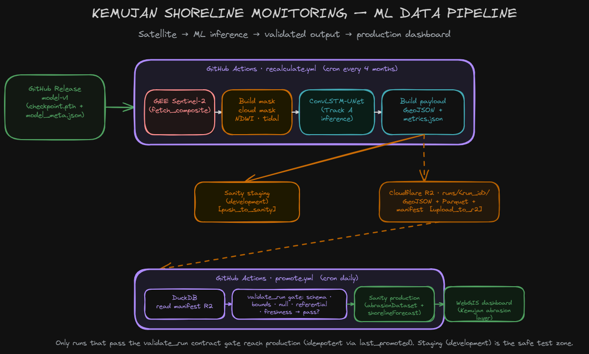
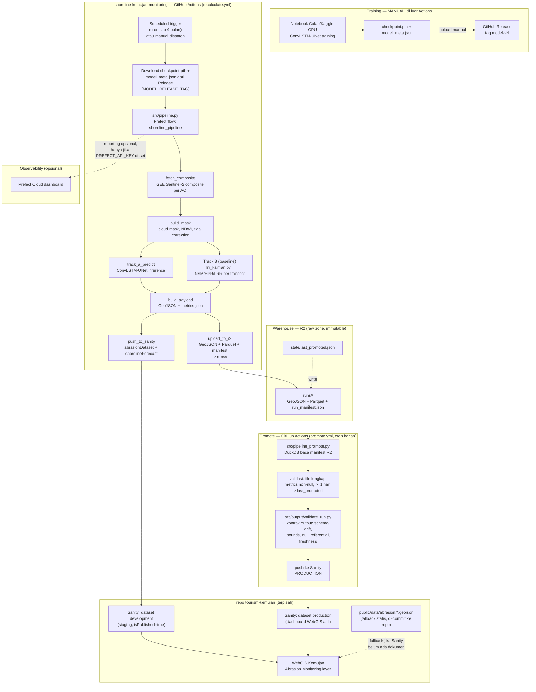

# shoreline-kemujan-monitoring


## Index

- [About](#about)
- [Architecture](#architecture)
- [Usage](#usage)
  - [Installation](#installation)
  - [Commands](#commands)
- [Development](#development)
  - [Pre-Requisites](#pre-requisites)
  - [Development Environment](#development-environment)
  - [File Structure](#file-structure)
  - [Deployment](#deployment)
- [Resources](#resources)
- [Credit/Acknowledgment](#creditacknowledgment)
- [License](#license)

## About

Repo ini **bukan** tempat training model. Ini pipeline *inference + monitoring* yang jalan
terjadwal via GitHub Actions: ambil composite Sentinel-2 terbaru, jalankan model ConvLSTM-UNet
yang sudah dilatih (Track A) sekaligus analisis transect independen NSM/EPR/LRR (Track B,
guaranteed floor — tetap menghasilkan output berguna walau checkpoint Track A belum/tidak
tersedia), lalu push hasilnya ke Sanity (`abrasionDataset` singleton + `shorelineForecast`
per-AOI-per-tahun) dan sebagai file statis (GeoJSON + `metrics.json`) yang jadi fallback di repo
website `tourism-kemujan`.

Orkestrasi tiap run sekarang pakai [Prefect](https://www.prefect.io/) (`src/pipeline.py`),
jalan ephemeral di dalam satu job GitHub Actions — bukan Prefect server yang nyala terus.
Prefect Cloud (dashboard) sifatnya opsional, cuma aktif kalau secret
`PREFECT_API_KEY`/`PREFECT_API_URL` di-set.

Training model dilakukan manual di Colab/Kaggle GPU, terpisah dari cron — checkpoint
di-promote ke Actions lewat GitHub Release (lihat bagian Usage di bawah).

## Architecture



## Usage

### Installation

```bash
git clone <repo-url>
cd shoreline-kemujan-monitoring
pip install -r requirements.txt
```

Dependencies utama: `earthengine-api`, `prefect`, `torch` (CPU di CI, GPU manual di
Colab/Kaggle untuk training), `numpy`, `scipy`, `shapely`, `scikit-image`. Untuk dev lokal
(notebook/geoprocessing manual) pakai `environment.yml` (conda): tambahan `geopandas`,
`rasterio`, `opencv`, `pyTMD` (koreksi pasang-surut), `geemap`.

### Commands

Satu entrypoint — Prefect flow menjalankan seluruh 6 task secara berurutan:

```bash
python -m src.pipeline --run-dir <path> --aoi-config config/aoi_points.geojson
```

Di Actions, `recalculate.yml` menjalankan command ini setelah men-download checkpoint dari
GitHub Release, lalu commit `data/state/` kembali ke repo. Push ke Sanity pergi ke dataset
**staging** (`development`); upload ke R2 (raw zone warehouse) jalan otomatis di task terakhir.

Entrypoint tambahan:

```bash
# Upload satu run output ke R2 warehouse (GeoJSON + Parquet + manifest) — dipakai pipeline
python -m src.output.upload_r2 --run-dir <path>

# Promote run terbaru yang valid dari R2 ke Sanity production (cron harian di promote.yml)
python -m src.pipeline_promote --dry-run   # tanpa --dry-run: benar-benar push ke production

# Validasi kontrak output (schema drift, bounds, freshness) untuk satu run
python -m src.output.validate_run --run-dir <run_dir>
python -m src.output.validate_run --run-dir <run_dir> --bounds-json bounds.json   # override batas default

# Mini e2e test output-contract (stdlib unittest, zero dep tambahan)
python -m unittest discover tests -v
```

> **Output-contract validation** (`src/output/validate_run.py`) memvalidasi 5 file terstruktur
> hasil pipeline (GeoJSON + metrics.json + forecast_docs.json) terhadap kontrak schema, batas
> fisik (EPR ±50 m/yr, NSM ≤ 3700 m, nTransects ≤ 40, AOI buffer 1500 m), null/completeness,
> referential integrity ke `config/aoi_points.geojson`, dan freshness (`run_utc`). Dipasang
> sebagai **gate sebelum push production** di `pipeline_promote.py`. GEE upstream (raster mentah)
> sengaja TIDAK divalidasi — data di sana unstructured; kontrak dimulai di titik data menjadi
> terstruktur (output `geojson.py`). Batas default bisa dituning via `--bounds-json`.

> Command lama (`scripts/fetch_composite.py`, `preprocess.py`, `infer_trackA.py`,
> `transect_trackB.py`, `postprocess.py`) sudah tidak dipakai — struktur pindah ke `src/`
> dengan satu Prefect flow, bukan 5 script terpisah.

## Development

### Pre-Requisites

- Python 3.11
- Akun Google Earth Engine + service account key (`GEE_SERVICE_ACCOUNT_KEY`)
- Write token Sanity (untuk `push_to_sanity`) — project `wm58nya7`, dataset staging
  (`development`) + production (`production`), token yang sudah di-rotate
- GitHub Release bertag sesuai `MODEL_RELEASE_TAG` di `recalculate.yml`, berisi
  `checkpoint.pth` + `model_meta.json`
- (Opsional) Akun Prefect Cloud + `PREFECT_API_KEY`/`PREFECT_API_URL` kalau mau dashboard
  reporting — pipeline tetap jalan penuh tanpa ini (ephemeral, in-Actions)
- (Opsional) Cloudflare R2 bucket untuk warehouse raw zone + secrets
  `R2_ACCOUNT_ID`/`R2_ACCESS_KEY_ID`/`R2_ACCESS_KEY_SECRET`/`R2_BUCKET` — tanpa ini
  task `upload_to_r2` SKIP otomatis, pipeline tetap jalan

### Development Environment

- Training tetap manual di Colab/Kaggle (bukan di Actions) — checkpoint + `model_meta.json`
  di-upload sebagai GitHub Release asset setelah training selesai (lihat `claude_result16.md`
  untuk langkah promote lengkap).
- Untuk dev lokal: buat `.env` (contoh di `.env.example`) dengan path
  `GEE_SERVICE_ACCOUNT_KEY` dan credential Sanity, lalu jalankan
  `python -m src.pipeline --run-dir <path>` langsung.

### File Structure

```
shoreline-kemujan-monitoring/
├── .github/workflows/
│   ├── recalculate.yml        # cron tiap 4 bulan / manual dispatch
│   └── promote.yml            # cron harian: promote run valid R2 -> Sanity production
├── src/
│   ├── pipeline.py             # Prefect flow entrypoint (orkestrasi 6 task)
│   ├── gee/                    # auth.py, composite.py, export.py, fetch.py
│   ├── preprocessing/          # mask.py, ndwi.py, tidal.py
│   ├── inference/               predict.py        # Track A
│   ├── baseline/                 lrr_kalman.py     # Track B
│   ├── analysis/                 metrics.py, spatial.py, transect.py, utils.py
│   ├── model/                    convlstm.py, dataset.py, evaluate.py, train.py
│   ├── pipeline_promote.py       # promote run valid dari R2 -> Sanity production
│   └── output/                   geojson.py, sanity_push.py, upload_r2.py, validate_run.py
├── config/
│   ├── aoi_points.geojson      # 9 AOI (8 dipakai training) — dipakai src/pipeline.py
│   ├── thresholds.json         # per-AOI mask threshold — sudah terisi 9 AOI
│   └── params.yaml             # placeholder DVC (0 byte, belum dipakai)
├── tests/
│   └── test_validate_run.py    # mini e2e output-contract (unittest, zero dep)
├── data/                        # state/ (rolling, termasuk lrr_baseline.json) dibuat saat run
├── models/                      # checkpoint + model_meta.json (via GitHub Release di CI)
├── notebooks/                   # training, manual di Colab/Kaggle
├── README.md
└── docs/infra.md                # perlu diperbarui menyusul (masih deskripsikan struktur lama)
```

| No | File/Folder | Details |
|----|---|---|
| 1 | `src/pipeline.py` | Prefect flow entrypoint — orkestrasi seluruh 6 task |
| 2 | `src/gee/fetch.py` + `composite.py` | Ambil composite Sentinel-2 terbaru per AOI |
| 3 | `src/preprocessing/mask.py` + `ndwi.py` + `tidal.py` | Cloud mask, NDWI, koreksi tidal |
| 4 | `src/inference/predict.py` | Track A — load checkpoint, inference ConvLSTM-UNet |
| 5 | `src/baseline/lrr_kalman.py` | Track B — NSM/EPR/LRR per transect (guaranteed floor) |
| 6 | `src/output/geojson.py` | Gabung Track A + Track B jadi GeoJSON + metrics.json |
| 7 | `src/output/sanity_push.py` | Push `abrasionDataset` + `shorelineForecast` ke Sanity (staging/production) |
| 8 | `src/output/upload_r2.py` | Upload run output ke R2 warehouse (GeoJSON + Parquet + manifest) |
| 9 | `src/pipeline_promote.py` | Promote run valid dari R2 → Sanity production (cron harian) |
| 10 | `src/output/validate_run.py` | Output-contract validation — gate sebelum push production |
| 11 | `tests/test_validate_run.py` | Mini e2e test output-contract (unittest, zero dep) |
| 12 | `config/aoi_points.geojson` | Daftar 9 AOI (8 dipakai training) |
| 13 | `config/thresholds.json` | Threshold mask per AOI — sudah terisi 9 AOI |

### Deployment

Deployment di sini artinya: hasil `build_payload`/`push_to_sanity` (GeoJSON + metrics.json,
plus dokumen Sanity `abrasionDataset`/`shorelineForecast`) dikirim ke sisi konsumen di repo
`tourism-kemujan`, yang lalu menampilkannya di WebGIS Kemujan (layer abrasi).

Alur staging → production:

1. **Staging**: tiap run `recalculate.yml` push langsung ke dataset Sanity **`development`**
   (`SANITY_DATASET_STAGING`) — ini zona aman, dashboard asli tidak terpengaruh.
2. **Warehouse**: output run yang sama di-upload ke R2 (`runs/<run_id>/`), queryable via DuckDB
   (Parquet) — arsip immutable + audit trail.
3. **Promote**: `promote.yml` (cron harian) membaca manifest R2 via DuckDB, mengambil run
   terbaru yang valid (file lengkap, metrics non-null, umur run ≥ 1 hari, dan lebih baru dari
   `state/last_promoted.json` di R2). Run terpilih lalu melewati **output-contract validation**
   (`validate_run.py`: schema drift, bounds fisik, null gate, referential integrity, freshness)
   sebelum di-push ke dataset **`production`** (`SANITY_DATASET_PRODUCTION`). Kalau ada
   pelanggaran, promote dibatalkan — data rusak tidak pernah sampai ke dashboard asli.
   Run yang sama tidak pernah di-promote dua kali.

Repo ini tidak deploy apa pun secara langsung — tidak ada infra cloud tambahan di luar
GitHub Actions + bucket R2.

## Resources

- [Project Impact](docs/Project_Impact.md) — value framing + roadmap (DE & ML engineering)
- Suryanti et al. (2025) — SWOT/IFAS shoreline management Karimunjawa
- Trinida et al. (2024) — prediksi garis pantai 2033/2043
- Dong et al. (2026, Computers & Geosciences) — object-based adaptive NDWI thresholding (SLIC)

## Credit/Acknowledgment

Benedictus Erwin Widianto — KKN-PPM UGM, Dusun Telaga, Kemujan, Karimunjawa,
di bawah DPL Dr. Desy Putri Handayani, S.Pi. Kolaborasi dengan Pokdarwis
Karang Tangguh, BTN/TNKJ.

## Infrastructure

Pipeline data berjalan otomatis lewat GitHub Actions (tanpa infra cloud tambahan seperti AWS),
plus Prefect (ephemeral, opsional Prefect Cloud untuk dashboard) buat orkestrasi/observability
tiap run, plus Cloudflare R2 sebagai warehouse raw zone (opsional). `docs/infra.md` masih
mendeskripsikan struktur lama (`ingest.py`/`etl.py`/`backtest.py`) dan perlu diperbarui
menyusul terpisah dari update README ini.

## License

TBD.
