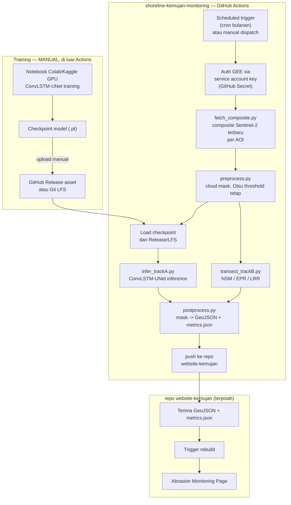

# shoreline-kemujan-monitoring

Pipeline otomatis untuk recalculate prediksi perubahan garis pantai Kemujan/Karimunjawa
dan push hasilnya ke website Pokdarwis (Abrasion Monitoring Page). Proker KKN-PPM UGM,
Desa Kemujan, Karimunjawa — untuk BTN/TNKJ dan Pokdarwis Karang Tangguh.

> Status progres, keputusan metodologis, known limitations, dan open questions
> ada di [`STATUS.md`](./STATUS.md) — dipisah dari README supaya README fokus
> ke cara pakai/develop, bukan catatan kerja.

## Index

- [About](#about)
- [Architecture](#architecture)
- [Usage](#usage)
  - [Installation](#installation)
  - [Commands](#commands)
- [Development](#development)
  - [Pre-Requisites](#pre-requisites)
  - [Development Environment](#development-environment)
  - [File Structure](#file-structure)
  - [Deployment](#deployment)
- [Resources](#resources)
- [Credit/Acknowledgment](#creditacknowledgment)
- [License](#license)

## About

Repo ini **bukan** tempat training model. Ini pipeline *inference + monitoring*
yang jalan terjadwal via GitHub Actions: ambil composite Sentinel-2 terbaru,
jalankan model ConvLSTM-UNet yang sudah dilatih (Track A) sekaligus analisis
transect independen NSM/EPR/LRR (Track B, guaranteed floor), lalu push hasilnya
sebagai file statis (GeoJSON + metrics) ke repo website Kemujan.

Training model dilakukan manual di Colab/Kaggle GPU, terpisah dari cron —
lihat [`STATUS.md`](./STATUS.md) untuk detail kenapa dan progresnya.

## Architecture



## Usage

### Installation

```
$ git clone <repo-url>
$ cd shoreline-kemujan-monitoring
$ pip install -r requirements.txt
```

Dependencies utama: `earthengine-api`, `geemap`, `rasterio`, `geopandas`,
`shapely`, `scikit-image`, `opencv-python`, `torch`.

### Commands

```
$ python scripts/fetch_composite.py     # ambil composite Sentinel-2 terbaru
$ python scripts/preprocess.py          # cloud mask + threshold
$ python scripts/infer_trackA.py        # inference ConvLSTM-UNet
$ python scripts/transect_trackB.py     # NSM/EPR/LRR
$ python scripts/postprocess.py         # generate GeoJSON + metrics.json
```

Di Actions, kelima command ini dijalankan berurutan oleh
`.github/workflows/recalculate.yml`.

## Development

### Pre-Requisites

- Python 3.10+
- Akun Google Earth Engine + service account key
- Akses tulis ke repo `website-kemujan` (deploy key/PAT)

### Development Environment

- Training tetap manual di Colab/Kaggle (bukan di Actions) — checkpoint
  di-upload ke Release asset/Git LFS setelah training selesai.
- Untuk dev lokal, buat `.env` dengan path `GEE_SERVICE_ACCOUNT_KEY` dan
  jalankan script satu-satu seperti di atas.

### File Structure

```
shoreline-kemujan-monitoring/
├── .github/workflows/
│   └── recalculate.yml
├── scripts/
│   ├── fetch_composite.py
│   ├── preprocess.py
│   ├── infer_trackA.py
│   ├── transect_trackB.py
│   └── postprocess.py
├── config/
│   └── aoi_points.json
├── README.md
└── STATUS.md
```

| No | File/Folder | Details |
|----|---|---|
| 1 | `scripts/fetch_composite.py` | Ambil composite Sentinel-2 terbaru per AOI |
| 2 | `scripts/preprocess.py` | Cloud mask, Otsu threshold tetap per AOI |
| 3 | `scripts/infer_trackA.py` | Load checkpoint, jalankan inference ConvLSTM-UNet |
| 4 | `scripts/transect_trackB.py` | Hitung NSM/EPR/LRR per transect |
| 5 | `scripts/postprocess.py` | Gabung hasil jadi GeoJSON + metrics.json |
| 6 | `config/aoi_points.json` | Daftar 9 AOI (8 dipakai training) |

### Deployment

Deployment di sini artinya: hasil `postprocess.py` (GeoJSON + metrics.json)
di-push oleh Actions ke repo `website-kemujan`, yang lalu trigger rebuild
static site-nya sendiri. Repo ini tidak deploy apa pun secara langsung.

## Resources

- Suryanti et al. (2025) — SWOT/IFAS shoreline management Karimunjawa
- Trinida et al. (2024) — prediksi garis pantai 2033/2043
- Dong et al. (2026, Computers & Geosciences) — object-based adaptive NDWI thresholding (SLIC)

## Credit/Acknowledgment

Benedictus Erwin Widianto — KKN-PPM UGM, Dusun Telaga, Kemujan, Karimunjawa,
di bawah DPL Dr. Desy Putri Handayani, S.Pi. Kolaborasi dengan Pokdarwis
Karang Tangguh, BTN/TNKJ.

## License

TBD.