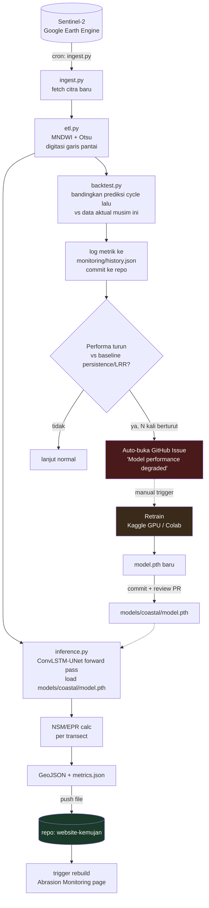

# Infrastruktur Pipeline — Shoreline Kemujan

## Ringkasan

Seluruh pipeline coastal berjalan lewat GitHub Actions, tanpa infra cloud
tambahan (AWS/GCP). Model disimpan langsung di repo. Monitoring performa
memakai backtest otomatis + GitHub Issues sebagai mekanisme alert —
tanpa dashboard atau database terpisah.

## Arsitektur

## Komponen

| Bagian | Tempat jalan | Catatan |
|---|---|---|
| Ingest + ETL | GitHub Actions (cron) | Ambil citra GEE, hitung shoreline/NSM/EPR |
| Inference | GitHub Actions (cron) | Model ringan (~400KB), forward pass saja, tidak perlu GPU |
| Backtest/monitoring | GitHub Actions (cron, sama run dengan inference) | Bandingkan prediksi cycle sebelumnya vs data aktual yang baru masuk |
| Alert | GitHub Issues (otomatis) | Dibuka Action kalau performa turun konsisten dari baseline |
| Training/retrain | Manual — Kaggle GPU / Colab | Dipicu manual (bukan cron), setelah Issue muncul atau evaluasi berkala |
| Penyimpanan model | Commit langsung ke repo (`models/coastal/model.pth`) | ~400KB, jauh di bawah limit GitHub, tidak perlu Git LFS/S3 |
| Delivery output | Push file ke repo "website kemujan" | Trigger rebuild situs (bagian Abrasion Monitoring) |

## Strategi retrain

**Tidak "set and forget".** Retrain manual periodik (bukan otomatis
setiap cron), dipicu oleh salah satu dari:
- GitHub Issue otomatis dari backtest yang mendeteksi performa turun
- Evaluasi berkala terjadwal manual (misal tiap pergantian tahun akademik
  atau musim tertentu)

Retrain baru masuk ke repo lewat pull request (bukan langsung commit ke
main), supaya ada titik review sebelum model produksi berubah — mengingat
proyek ini pernah punya bug arsitektur yang lolos tanpa terdeteksi
sampai diperiksa manual.

## Strategi monitoring

Backtest sederhana: tiap kali musim baru masuk lewat ETL, prediksi
rollout yang dibuat pipeline pada cycle sebelumnya (untuk musim yang
sama) dibandingkan ke data aktual yang baru tersedia. Metrik (Dice/error
vs baseline persistence dan LRR) dicatat sebagai file JSON yang di-commit
ke repo — jadi riwayat performa model bisa dilihat langsung dari histori
Git, tanpa database atau dashboard terpisah.

## Yang ditolak dari rencana awal

Sempat direncanakan pakai stack AWS penuh: Terraform (VPC, Aurora
Serverless v2, Lambda, CloudFront, S3 dengan lifecycle ke Glacier),
budget cap $15/bulan. Ini **dibatalkan** — GitHub Actions + repo Git
dinilai cukup untuk kebutuhan cron periodik dan penyimpanan model
berukuran kecil, tanpa perlu database terkelola atau CDN terpisah.

## Yang belum diputuskan

- Apakah repo "website kemujan" itu repo yang sama dengan proker etalase
  digital (Karyakarsa wrapper), atau repo statis terpisah khusus untuk
  halaman Abrasion Monitoring
- Format file downstream persis: GeoJSON polyline shoreline saja, atau
  disertai JSON metrics NSM/EPR per transect
- Autentikasi GEE di GitHub Actions runner — perlu service account key
  (bukan `ee.Authenticate()` interaktif yang dipakai di notebook),
  disimpan sebagai GitHub Secret
- Konversi notebook cells (`ShorelineProcessor256`, `Orch256`,
  `AdaptiveOrch256`) menjadi script `.py` standalone yang jalan tanpa
  Colab/Jupyter runtime
- Threshold pasti "N kali berturut-turun" untuk trigger Issue otomatis
  belum ditentukan angkanya