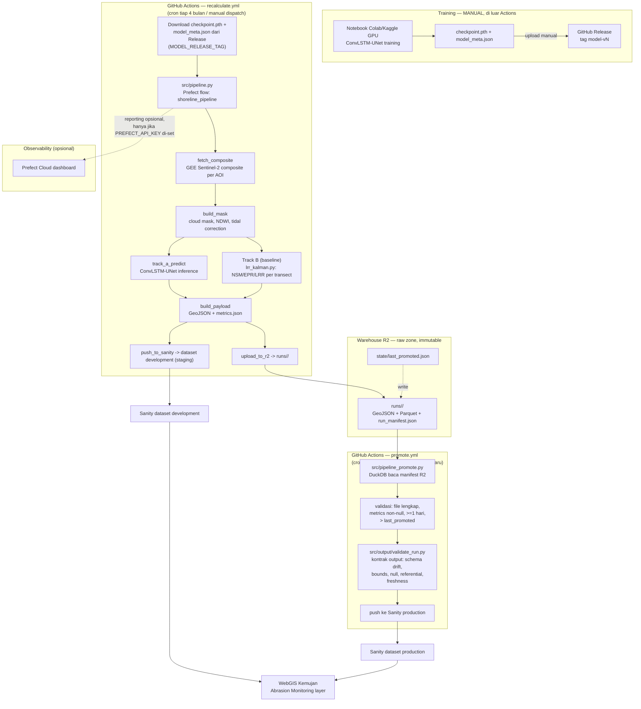

# Infrastruktur Pipeline — Shoreline Kemujan

## Ringkasan

Seluruh pipeline coastal berjalan lewat **GitHub Actions**, tanpa infra cloud
tambahan (AWS/GCP) di luar bucket **Cloudflare R2** yang dipakai sebagai
warehouse raw zone (opsional). Orkestrasi tiap run memakai **Prefect**
(`src/pipeline.py`) yang jalan **ephemeral di dalam runner Actions** — bukan
server/worker/agent Prefect yang nyala terus, sehingga biaya monitoring $0.
Model disimpan sebagai **GitHub Release asset** (tag `model-vN`), bukan
di-commit ke repo. Delivery output ke dashboard WebGIS lewat Sanity
(`abrasionDataset` singleton + `shorelineForecast` per-AOI-per-tahun), dengan
alur staging (`development`) → production (`production`).

## Arsitektur

## Komponen

| Bagian | Tempat jalan | Catatan |
|---|---|---|
| Ingest + ETL | GitHub Actions (`recalculate.yml`, cron tiap 4 bulan) | `fetch_composite` (GEE Sentinel-2) + `build_mask` (MNDWI/tidal) |
| Inference | GitHub Actions (cron yang sama) | Model ringan (~350KB), forward pass saja, tidak perlu GPU |
| Track B (baseline) | GitHub Actions (cron yang sama) | `lrr_kalman.py`: NSM/EPR/LRR per transect — guaranteed floor |
| Push staging | GitHub Actions (cron yang sama) | `push_to_sanity` → dataset Sanity `development` |
| Warehouse | Cloudflare R2 (opsional) | Raw zone immutable: GeoJSON + Parquet + manifest, queryable via DuckDB |
| Promote | GitHub Actions (`promote.yml`, cron harian) | Validasi run terbaru ≥1 hari & > `last_promoted` + **output-contract check** (`validate_run.py`) → push dataset `production` |
| Model versioning | GitHub Release (tag `model-vN`) | `checkpoint.pth` + `model_meta.json`; pipeline baca dinamis dari `MODEL_RELEASE_TAG` |
| Monitoring | Prefect Cloud (opsional, $0) | Flow ephemeral lapor via HTTP; tanpa `PREFECT_API_KEY` tetap jalan normal |
| Training/retrain | Manual — Kaggle GPU / Colab | Dipicu manual (bukan cron), setelah Issue muncul atau evaluasi berkala |
| Delivery output | Sanity (staging + production) | WebGIS Kemujan baca dataset production (dengan fallback GeoJSON statis di repo website) |

## Alur staging → production

1. **Staging**: tiap run `recalculate.yml` push langsung ke dataset Sanity
   `development` (`SANITY_DATASET_STAGING`) — zona aman, dashboard asli
   (`production`) tidak terpengaruh oleh testing.
2. **Warehouse**: output run yang sama di-upload ke R2 (`runs/<run_id>/`),
   queryable via DuckDB (Parquet) — arsip immutable + audit trail.
3. **Promote**: `promote.yml` (cron harian) membaca manifest R2, mengambil run
   terbaru yang valid (file lengkap, metrics non-null, umur run ≥ 1 hari, dan
   lebih baru dari `state/last_promoted.json` di R2). Run terpilih melewati
   **output-contract validation** (`validate_run.py`: schema drift, bounds fisik,
   null gate, referential integrity ke `config/aoi_points.geojson`, freshness)
   sebelum push ke dataset `production`. Ada pelanggaran → promote dibatalkan.
   Run yang sama tidak pernah di-promote dua kali.

> **Scope validation**: hanya output pipeline (5 file terstruktur dari `geojson.py`)
> yang divalidasi. GEE upstream (raster mentah) sengaja tidak — data di sana
> unstructured, dan batas fisik (threshold) sudah dijaga di preprocessing
> (`mask.py`, `thresholds.json`). Kontrak dimulai di titik data menjadi terstruktur.

## Strategi retrain

**Tidak "set and forget".** Retrain manual periodik (bukan otomatis
setiap cron), dipicu oleh salah satu dari:
- Evaluasi berkala terjadwal manual (misal tiap pergantian musim)
- Diagnosis performa turun dari hasil banding prediksi rollout vs data aktual

Retrain menghasilkan checkpoint baru → di-upload sebagai GitHub Release tag
baru (`model-vN+1`) → bump `MODEL_RELEASE_TAG` di `recalculate.yml` → pipeline
berikutnya otomatis memakai model baru. Detail runbook di `claude_result16.md`.

## Strategi monitoring

- **Prefect (opsional)**: flow `shoreline_pipeline` melaporkan tiap task
  (`fetch_composite` → `build_mask` → `track_a_predict` → `build_payload` →
  `push_to_sanity` → `upload_to_r2`) ke Prefect Cloud kalau
  `PREFECT_API_KEY`/`PREFECT_API_URL` di-set. Tanpa itu, flow tetap jalan
  lokal/ephemeral tanpa lapor kemana-mana.
- **Riwayat performa**: metrik tiap run (`metrics.json`) masuk ke warehouse R2
  dan dataset staging/production Sanity — bisa dilihat dari riwayat run +
  Parquet queryable.

## Yang ditolak dari rencana awal

Sempat direncanakan pakai stack AWS penuh: Terraform (VPC, Aurora
Serverless v2, Lambda, CloudFront, S3 dengan lifecycle ke Glacier),
budget cap $15/bulan. Ini **dibatalkan** — GitHub Actions + R2 bucket
dinilai cukup untuk kebutuhan cron periodik dan penyimpanan model
berukuran kecil, tanpa perlu database terkelola atau CDN terpisah.

## Yang belum diputuskan

- Apakah repo website (frontend `tourism-kemujan`) baca Sanity production
  saja, atau juga perlu fallback GeoJSON statis di repo website
- Threshold pasti "N kali berturut-turun" untuk trigger Issue otomatis
  belum ditentukan angkanya (backtest/alert otomatis belum diimplementasikan)
- Migrasi warehouse dari R2 ke solusi ber-query engine penuh (mis. DuckDB
  + Parquet sudah aktif; Athena/Supabase bisa jadi tahap berikutnya)
